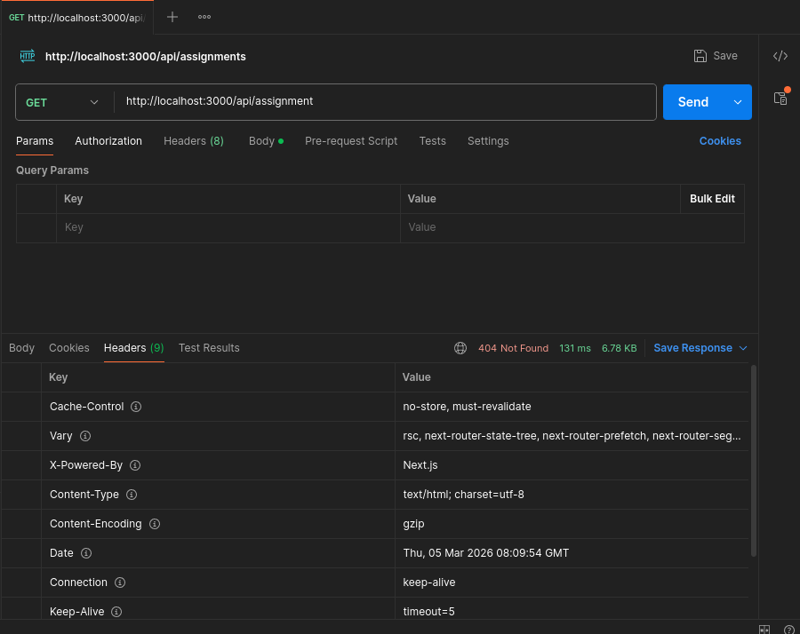

# Assignment Log Book App

## Data Model

`Assignment`

| Field | Type | Required | Notes |
| --- | --- | --- | --- |
| `id` | `string` | Yes | Generated with `crypto.randomUUID()` on create |
| `title` | `string` | Yes | Assignment title |
| `description` | `string` | Yes | Assignment description |
| `dueDate` | `string` | Yes | Due date (use calendar function) |
| `status` | `"Create" \| "On Process" \| "Submitted"` | Yes | Default to `"Create"` |
| `createdAt` | `string` | Yes | Assignment date - auto-generated ISO timestamp |

## API Design Table

| Endpoint | Method | API Endpoint Description | Scenario | Requirement | Expected Output | Actual Output | Test Status |
| --- | --- | --- | --- | --- | --- | --- | --- |
| `/api/assignments` | `GET` | List all assignments | Success | None | Status: 200, `{ success: true, data: Assignment[] }` | Returns current in-memory array as-is | Passed |
| **Evidence:** | | | | |  | | |
| `/api/assignment` | `GET` | Wrong endpoint URL | Error | URL not found | Status: 404 | Next.js handles invalid routes | Passed |
| **Evidence:** | | | | |  | | |
| `/api/assignments` | `POST` | Create new assignment | Success | `title`, `description`, `dueDate` provided | Status: 201, `{ success: true, data: Assignment }` with generated `id` and `createdAt` | Generates UUID for `id`, ISO timestamp for `createdAt`, defaults `status` to `"Create"` | Passed |
| **Evidence:** | | | | |  | | |
| `/api/assignments` | `POST` | Create new assignment | Error | Missing required field (e.g., `title`) | Status: 400, `{ success: false, message: "title, description, and dueDate are required" }` | Validates all three required fields | Passed |
| **Evidence:** | | | | |  | | |
| `/api/assignments/{id}` | `GET` | Fetch assignment by ID | Success | Valid `id` exists | Status: 200, `{ success: true, data: Assignment }` | Exact match lookup on `Assignment.id` | Passed |
| **Evidence:** | | | | |  | | |
| `/api/assignments/{id}` | `GET` | Fetch assignment by ID | Error | Assignment not found | Status: 404, `{ success: false, message: "Assignment not found" }` | Returns 404 when `id` not in array | Passed |
| **Evidence:** | | | | |  | | |
| `/api/assignments/{id}` | `PUT` | Update assignment (partial merge) | Success | Valid `id` and partial body | Status: 200, `{ success: true, data: Assignment }` | Merges body with `{ ...existing, ...body }` | Passed |
| **Evidence:** | | | | |  | | |
| `/api/assignments/{id}` | `PUT` | Update assignment (partial merge) | Error | Assignment not found | Status: 404, `{ success: false, message: "Assignment not found" }` | Returns 404 when `id` not in array | Passed |
| **Evidence:** | | | | |  | | |
| `/api/assignments/{id}` | `DELETE` | Delete assignment | Success | Valid `id` exists | Status: 200, `{ success: true, message: "Assignment deleted", data: Assignment }` | Removes element via `splice`, returns deleted record | Passed |
| **Evidence:** | | | | |  | | |
| `/api/assignments/{id}` | `DELETE` | Delete assignment | Error | Assignment not found | Status: 404, `{ success: false, message: "Assignment not found" }` | Returns 404 when `id` not in array | Passed |
| **Evidence:** | | | | |  | | |